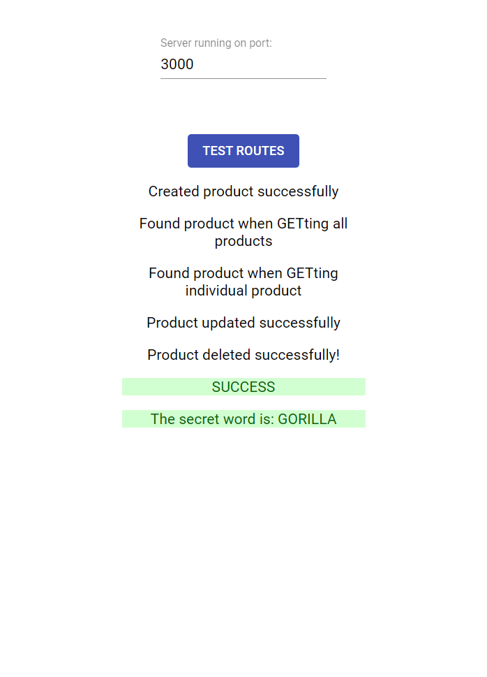

<b># go-fullstack</b>
<h1> Passez au Full Stack avec Node.js, Express et MongoDB </h1>

<h2> Chapitre 1. Tirez le maximum de ce cours. </h2>

<h2> Chapitre 2. Configurez votre environnement de développement. </h2>

  <b>En résumé</b>
    Node peut être installé à partir de NodeJS.org.

    L'application front-end pour ce cours peut être clonée avec  git clone  , installée avec  npm install  , et lancée avec  npm run start

    ... Maintenant que votre environnement de développement est configuré, voyons ensemble comment démarrer votre serveur Node ! 
    
<h2> Chapitre 3. Démarrez votre serveur Node. </h2>

  <b>En résumé</b>
    Les projets Node sont initialisés avec la commande  npm init  .

    Un serveur Node basique est démarré avec la méthode  createServer  du package  http  .

    Nodemon est un package qui mettra à jour votre serveur démarré à chaque changement de fichier, vous facilitant le développement Node.

    ... Prêt à créer une application Express ? C'est ce que nous allons faire dans le chapitre suivant ! 
    
<h2> Chapitre 4. Créez une application Express. </h2>

  <b>En résumé</b>
    Le framework Express est installé et enregistré dans le  package.json  avec   npm install express  .

    Pour créer une application Express, appelez simplement la méthode  express()  .

    Un middleware est un bloc de code qui traite les requêtes et réponses de votre application.

    Ajouter la normalisation de port, la gestion d'erreur et du logging basique à votre serveur Node le rend plus constant et plus facile à déboguer.

    ... Maintenant que vous savez utiliser le framework Express, nous allons pouvoir pour de bon commencer à créer notre API. Rendez-vous dans le chapitre suivant ! 

<h2> Chapitre 5. Créez une route GET. </h2>

  <b>En résumé</b>
    La méthode app.use() vous permet d'attribuer un middleware à une route spécifique de votre application.

    Le CORS définit comment les serveurs et les navigateurs interagissent, en spécifiant quelles ressources peuvent être demandées de manière légitime – par défaut, les requêtes AJAX sont interdites.

    Pour permettre des requêtes cross-origin (et empêcher des erreurs CORS), des headers spécifiques de contrôle d'accès doivent être précisés pour tous vos objets de réponse.

    ... Maintenant que nous avons créé notre route Get, nous allons créer une route Post, dans le chapitre suivant !
    
<h2> Chapitre 6. Créez une route POST. </h2>

  <b>En résumé</b>
    En passant votre middleware à  app.post()  au lieu de  app.use()  , il répondra uniquement aux requêtes de type POST.

    Qu'avons-nous appris dans cette première partie ?
    
    Dans cette première partie du cours, vous avez :

    Configuré votre environnement de développement, avec toutes les dépendances requises pour démarrer ;

    Démarré votre premier serveur Node et l'avez utilisé pour gérer votre première application Express ;

    Créé deux routes pour votre application, et vous avez également implémenté CORS pour vous assurer que le front-end pouvait effectuer des appels vers votre application en toute sécurité.

    ... Dans la partie suivante du cours, vous ajouterez la couche de base de données MongoDB. Celle-ci est essentielle pour votre application, et permettra de la rendre entièrement dynamique.
    
<h2> Chapitre 7. Êtes-vous prêt à créer un serveur Express ? </h2>
QUIZ - Bravo ! Vous avez réussi cet exercice !

  Compétences évaluées
  Créer un serveur web simple avec Express
  
  <b>Question 1</b>
  En créant un serveur HTTP avec Node, on utilise la fonction  createServer()  . On peut passer une fonction à  createServer()  qui réagira aux requêtes entrantes. Quels arguments reçoit cette fonction passée ?

  Attention, plusieurs réponses sont possibles.

    ✅ L'objet requête

    ✅ L'objet réponse

    · La fonction  next()

    · La variable environnement  PORT
  
  La fonction passée en argument à  createServer()  recevra les objets requête et réponse comme arguments, généralement raccourcis en  req  et  res  . La fonction  next()  existe uniquement à l'intérieur d'une application Express, et la fonction passée ne reçoit pas de variables environnement comme arguments.

  <b>Question 2</b>
  Dans une application Express, que doit faire le dernier middleware pour une route donnée pour empêcher les requêtes d'expirer ?

    · Modifier le statut de l'objet réponse

    ✅ Renvoyer la réponse au client

    · Modifier les headers de l'objet réponse

    · Appeler la fonction  next()
  
  Le dernier middleware d'une chaîne doit renvoyer la réponse au client pour empêcher la requête d'expirer.

  <b>Question 3</b>
  À quoi sert la fonction  next()  ?

    · Elle renvoie la réponse au client

    · Elle empêche les erreurs CORS

    ✅ Elle passe l'exécution au prochain middleware de la chaîne

    · Elle analyse le corps de la requête
  
  Un middleware appelle la fonction  next()  pour passer l'exécution au prochain middleware de la chaîne.

  <b>Question 4</b>
  Un code HTTP de 200 représente généralement :

    · Une erreur serveur

    ✅ Une requête réussie

    · Une création de données réussie

    · Une erreur d'authentification
    
  Un code HTTP de 200 est le code standard pour une requête réussie, surtout pour des requêtes GET.

  <b>Question 5</b>
  Un code HTTP de 201 représente généralement :

    · Une erreur serveur

    · Une requête réussie

    ✅ Une création de données réussie

    · Une erreur d'authentification
  
  Un code 201 signifie généralement que la requête a réussi, et a causé la création d'une nouvelle ressource.

  <b>Question 6</b>
  Une erreur CORS peut survenir quand :

    · une requête HTTP expire

    · le serveur répond avec une erreur inconnue

    · la connexion est perdue pendant un transfert de données

    ✅ le serveur et le client ne partagent pas la même origine
  
  La sécurité CORS est une mesure de sécurité par défaut pour empêcher l'utilisation de ressources par des origines non autorisées.

  <b>Question 7</b>
  Quelle méthode permet d'empêcher des erreurs CORS ?

    ✅ Configurer des headers spécifiques sur l'objet réponse

    · Configurer des headers spécifiques sur l'objet requête

    · Utiliser le bon code HTTP

    · Envoyer la réponse en format JSON
  
  Configurer les bons headers sur l'objet réponse permet l'envoi et la réception de requêtes et de réponses sans erreurs CORS.

  <b>Question 8</b>
  Le package  body-parser  :

    · permet d'éviter les erreurs CORS

    · permet la persistance de données

    ✅ rend les données du corps de la requête exploitables

    · convertit les données de l'objet réponse en JSON
  
  Quand une requête HTTP est reçue par le serveur, son corps est rarement sous forme utile. Le package body-parser analyse le corps de la requête, et le formate pour en faciliter l'exploitation.

<h2> Chapitre 8. Configurez votre base de données. </h2>

  <b>En résumé</b>
    Pour des applications qui ont besoin d'évoluer rapidement, les bases de données NoSQL comme MongoDB sont souvent un bon choix de technologie.

    MongoDB Atlas permet d'héberger gratuitement une base de données MongoDB.

    Le package Mongoose facilite les interactions entre votre application Express et votre base de données MongoDB.

    ... Maintenant que vous avez configuré votre base de données, voyons ensemble comment créer un schéma de données pour rendre notre application robuste, dans le chapitre suivant ! 

<h2> Chapitre 9. Créez un schéma de données. </h2>

  <b>En résumé</b>
    La méthode  Schema  de Mongoose vous permet de créer un schéma de données pour votre base de données MongoDB.

    La méthode  model  transforme ce modèle en un modèle utilisable.

    ... Maintenant que vous avez défini le schéma de données, voyons comment sauvegarder et récupérer les données de notre base de données !
    
<h2> Chapitre 10. Enregistrez et récupérez des données. </h2>

  <b>En résumé</b>
    Les méthodes de votre modèle Thing permettent d'interagir avec la base de données :

      · save()  – enregistre un Thing ;

      · find()  – retourne tous les Things ;

      · findOne()  – retourne un seul Thing basé sur la fonction de comparaison qu'on lui passe (souvent pour récupérer un Thing par son identifiant unique).

    La méthode  app.get()  permet de réagir uniquement aux requêtes de type GET.

    ... Dans le prochain chapitre, nous utiliserons le reste des opérations CRUD pour mettre à jour et supprimer nos données dans la base de données. Allons-y ! 

<h2> Chapitre 11. Modifiez et supprimez des données. </h2>

  <b>En résumé</b>
    · app.put()  et  app.delete()  attribuent des middlewares aux requêtes de type PUT et de type DELETE.

    · Les méthodes  updateOne()  et  delete()  de votre modèle Thing permettent de mettre à jour ou de supprimer un Thing dans la base de données.

  <b>Qu'avons-nous appris dans cette partie du cours ?</b>
    · Vous avez configuré votre base de données MongoDB et l'avez connectée à votre application Express.

    · Vous avez utilisé Mongoose pour créer un modèle de données afin de faciliter les opérations de la base de données.

    · Vous avez implémenté, dans votre application Express, les routes CRUD qui exploitent votre modèle de données Mongoose, rendant ainsi votre application entièrement dynamique.

    ... Dans la partie suivante de ce cours, nous nous pencherons sur une thématique extrêmement importante : la sécurité.

<h2> Chapitre 12. QUIZ. Savez-vous implémenter le CRUD ? </h2>

  <b>Compétences évaluées</b>
  Créer une API REST avec Node, Express et MongoDB
  
  <b>Description</b>
  Ce quiz est en fait un réel cas pratique, dans lequel vous aurez l'opportunité de tester vos compétences en codant !

  Pour pouvoir répondre correctement, il vous faudra créer une API fonctionnelle comme nous venons de le faire pendant le cours. 
  Votre API devra être connectée à une base de données, car les différentes opérations CRUD seront testées et vérifiées !

  Vous allez créer une API basique pour une boutique en ligne qui permet de créer, lire, modifier et supprimer des produits ( Product ). 
  
  Les Product auront quatre champs obligatoires :

    · name : le nom du produit, de type String ;
    · description : la description du produit, de type String ;
    · price : le prix du produit, de type Number ;
    · inStock : si le produit est en stock, de type Boolean.
  
  Vous allez implémenter cinq routes :

    <b>GET:</b> /api/products
      Retournera tous les produits sous la forme{ products: Product[] }
    <b>GET:</b> /api/products/:id
      Retournera le produit avec le_id fourni sous la forme { product: Product }
    <b>POST:</b> /api/products
      Créera un nouveau Product dans la base de données.
      Le corps de la requête a pour forme :
      {
          "name": string,
          "description": string,
          "price": number,
          "inStock": boolean
      }
      Il retournera le Product ainsi créé (y compris son champ _id ), sous la forme{ product: Product }.

      La Promise retournée par la méthode save() de votre modèle Mongoose reçoit le produit créé :

      product.save()
      .then(product => ... ... .json({ product }))
      .catch(error => ... ...)
    <b>PUT:</b> /api/products/:id
      Modifiera le produit avec le _id fourni selon les données envoyées dans le corps de la requête.
      Le corps de la requête a pour forme :
      {
          "name": string,
          "description": string,
          "price": number,
          "inStock": boolean
      }
      Retournera un objet de la forme{ message: 'Modified!' }
    <b>DELETE :</b> /api/products/:id
      Supprimera le produit avec le _id fourni.
      Retournera un objet de la forme { message: 'Deleted!' }
      
  Votre API devra tourner sur votre machine locale en localhost (de préférence en port 3000, mais l'application front-end vous permet de modifier ce port si besoin) et accepter les requêtes HTTP venant de n'importe quelle origine (n'oubliez pas la configuration CORS !).

  Pour tester votre API, vous allez installer une mini-application front-end. Clonez le repo avec le code frontend sur ce lien.

  Depuis le dossier cloné, exécutez npm install puis npm start . Vous devriez voir s'ouvrir une fenêtre de navigateur comme celle-ci :
  
  Voir: https://openclassrooms.com/fr/courses/6390246-passez-au-full-stack-avec-node-js-express-et-mongodb/exercises/3732
  Front end app
  Application front-end
  
  Si votre serveur tourne, cliquez sur TEST ROUTES pour lancer les tests. 
  Ces tests vous permettront de vérifier que vous avez bien réussi à implémenter les routes demandées, et donc de valider ce quiz ! 
  Vous verrez apparaître des messages de succès (ou d'erreur) selon que l'application a réussi à faire fonctionner votre API ou non.

  Si votre navigateur s'ouvre avec une erreur 404, attendez quelques secondes et faites un refresh.

  Parfois, lors de la première tentative après le lancement de l'application, celle-ci émet une erreur même si l'API fonctionne. 
  Recliquez sur TEST ROUTES. S'il y a toujours une erreur, il est probable qu'elle vienne de votre API.

  <b>Question 1</b>
  Quand tout fonctionnera bien, l'application de test affichera un mot secret. Quel est ce mot secret ? Sélectionnez-le dans la liste ci-dessous :

        · GIRAFFE

        · ELEPHANT

        ✅ GORILLA

        · ZEBRA

<h2> Chapitre 13. Optimisez la structure du back-end. </h2>

